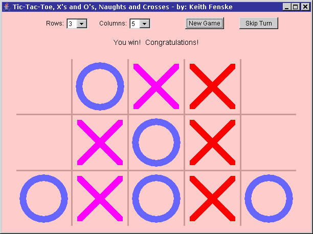

### Tic-Tac-Toe Game (Java)

by: Keith Fenske, https://kwfenske.github.io/

TicTacToe is an old Java 1.1 AWT (GUI) applet to play the child's game of
Tic-Tac-Toe, also known as Ticktacktoe, X's and O's, Naughts and Crosses. Click
the mouse on a position of your choice. You are the magenta X's and you move
first. The computer has the blue O's. To win, you must have a complete
horizontal line, a complete vertical line, or a complete diagonal line. There
can be several diagonals. Winning lines are shown in red. For instructions on
how best to play the game ... ask a child! The only weird part is that the
number of rows and columns can be different.

This applet runs as a single class in the main GUI thread and does not have a
delay or any animation before the computer's move appears. Code for that can be
copied from
the [Dots and Boxes](https://github.com/kwfenske/dots-and-boxes-game-java) game
or the [Reversi](https://github.com/kwfenske/reversi-game-java) game.

The program's comments and documentation reference web sites that no longer
exist, and discuss differences in Java versions that are now meaningless. No
changes will be considered. Web page applets are obsolete and may run as
stand-alone applications with the help of a wrapper (included). This becomes
less likely after Java 9 (2017). Rewriting for Java Swing or newer JavaFX is
not an easy job.

Download the ZIP file here: https://kwfenske.github.io/tic-tac-toe-game-java.zip

Released under the terms and conditions of the GNU General Public License,
version 3 or later (GPLv3+).

